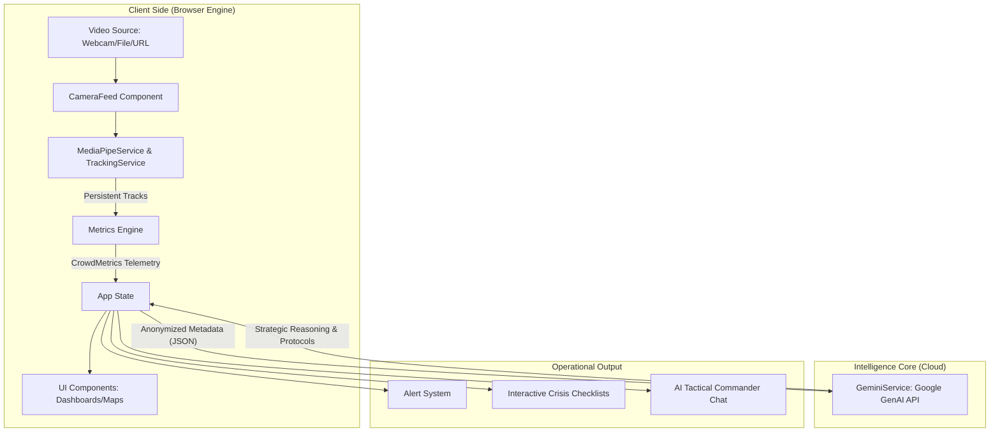
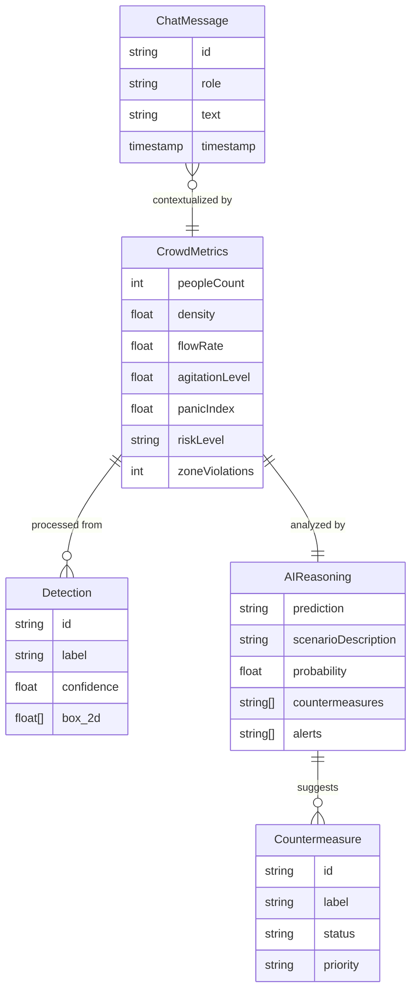

# CrowdSense™ Intelligence Suite
### *Enterprise Real-Time Crowd Risk Intelligence*


> **Hackathon Track:** Safety & Security / AI Agents  
> **Powered By:** Google Gemini 3.0 Flash & Edge-Based Computer Vision

---

## 🚨 The Problem
Managing large crowds at stadiums, transport hubs, and public events is traditionally **reactive**. Security teams rely on raw video feeds and intuition, leading to:
1.  **Information Overload:** Operators cannot track hundreds of individuals simultaneously.
2.  **Delayed Response:** Critical density thresholds are often noticed only *after* congestion begins.
3.  **Privacy Risks:** Sending live video streams to the cloud for analysis is costly and violates privacy compliance (GDPR/CCPA).

## 💡 The Solution: Hybrid Intelligence
**CrowdSense™** solves this by splitting the workload:
1.  **The Eyes (Edge AI):** A specialized **MediaPipe Tasks Vision** engine (using **EfficientDet-Lite0**) runs directly in the browser via WebAssembly to detect people and calculate density metrics in real-time. **No video leaves the device.**
2.  **The Brain (Gemini 3.0):** Only anonymized mathematical metadata (flow rates, density vectors, persistent track IDs) is sent to **Gemini 3.0 Flash**. The AI acts as a "Strategic Commander," predicting stampede risks and generating tactical protocols.

---

## ✨ Dynamic Feature Ecosystem

### 🧠 Core Intelligence (Gemini 3.0)
1.  **Predictive Stampede Modeling:** Uses historical flow data to forecast density spikes up to 90 seconds in advance, giving staff time to react *before* critical mass is reached.
2.  **Visual Scenario Narrator:** Converts raw pixel data into vivid, natural language Situation Reports (e.g., "Crowd is stagnating at the West Exit; high agitation detected"), bridging the gap between raw metrics and human understanding.
3.  **Interactive Crisis Checklists:** Dynamic Standard Operating Procedures (SOPs) that evolve in real-time. If Gemini detects a blockage, the UI instantly generates tasks like "Deploy Barrier Team A" or "Open Emergency Gate 4."
4.  **Adaptive "Defcon" Risk Logic:** The system autonomously adjusts alert sensitivity based on context—differentiating between a "celebratory mosh pit" (high density, low risk) and a "crush" (high density, high risk) via context awareness.

### 👁️ Advanced Vision (Edge AI)
5.  **Panic Vector Analysis:** Tracks the *variance* in crowd velocity (Agitation Index). It distinguishes between a fast commute and a chaotic panic run using frame-to-frame centroid deltas.
6.  **Object-Based Threat Recon:** Goes beyond people counting to detect safety anomalies: abandoned luggage (suspicious packages), weapons (bats/knives), or mass smartphone recording (distraction events).
7.  **Counter-Flow Detection:** Specifically identifies individuals or groups moving against the primary flow of traffic—often the earliest warning sign of a blockage or emergency upstream.
8.  **BYOM (Bring Your Own Model):** A hot-swappable inference engine. Security teams can drag-and-drop custom trained `.onnx` models (YOLOv8/v10/v11) to optimize for specific environments (e.g., thermal cameras or drone footage).

### 🛠️ The "Butter-Smooth" Algorithm
9.  **Greedy-Match Tracking (Bubble-Style Logic):** To ensure maximum speed with zero overhead, we implemented a greedy IoU (Intersection over Union) matching algorithm. Much like a **Bubble Sort**, it iteratively compares incoming detections with existing tracks to find the optimal pair, ensuring persistent identities with minimal computational cost.
10. **EMA Smoothing Engine:** We eliminate "visual jitter" using **Exponential Moving Average (EMA)** filtering ($\alpha = 0.3$). This mathematically glides the bounding boxes between frames, providing a "butter-smooth" high-fidelity experience that masks raw model fluctuations.
11. **Zero-Lag Polling Loop:** By decoupling the inference loop and optimizing it to a **50ms (20 FPS)** heartbeat, we achieve highly responsive tracking that feels native to the video hardware, bypassing traditional browser-based inference lagginess.

---

## 🛠️ Tech Stack

### Artificial Intelligence
- **Reasoning Engine:** Google Gemini API (`gemini-3-flash-preview`)
- **Computer Vision:** MediaPipe Tasks Vision (EfficientDet-Lite0)
- **Tracking:** ByteTrack-lite + EMA Smoothing Algorithm
- **Runtime:** MediaPipe Web (WASM + GPU Delegate)

### Frontend & Visualization
- **Framework:** React 19 + TypeScript + Vite
- **Styling:** Tailwind CSS (Glassmorphism UI)
- **Charts:** Recharts
- **Video Processing:** HTML5 Canvas + HLS.js

---

### Intelligence Architecture

#### System Architecture


#### Data Relationship Diagram (ERD)


---

## 🚀 How It Works

1.  **Ingestion:** Video is captured via Webcam, File Upload, or IP Camera Stream (HTTP/MJPEG).
2.  **Detection & Tracking:** The browser extracts frames and passes them to the local **MediaPipe Object Detector** (EfficientDet-Lite0). Detections are then processed by the **ByteTrack** algorithm with **EMA Smoothing** to maintain persistent IDs.
3.  **Metrics Calculation:** The app calculates `People Count`, `Density (p/m²)`, and `Flow Velocity` (derived from track history).
4.  **Reasoning Loop:**
    - Every few seconds (or on trigger), metadata is JSON-serialized.
    - **Gemini 3.0** analyzes the metadata against safety heuristics.
    - A structured JSON response returns predictions and countermeasures.
5.  **Action:** The UI updates the Risk Gauge and populates the "Response Protocol" checklist.

---

## 🧬 Deep Dive: Crowd Risk Intelligence Algorithm

### 3.1 System Overview
CrowdSense™ implements a **Hybrid Edge–Cloud Intelligence Architecture** composed of:
- **Edge-based object detection** (EfficientDet-Lite0)
- **Multi-object tracking** (ByteTrack-lite)
- **Motion smoothing** (Exponential Moving Average)
- **Real-time crowd metric extraction**
- **Cloud-based predictive reasoning** using Google Gemini 3.0 Flash

### 3.2 Edge-Based Object Detection
The system uses **EfficientDet-Lite0**, deployed via MediaPipe Tasks Vision in WebAssembly.
- **Model Logic:** Uses a Bi-directional Feature Pyramid Network (BiFPN) and compound scaling to balance accuracy and latency.
- **Performance:** Optimized for browser-level inference at ~90 FPS.
- **Output ($D$):** For each frame, it identifies $D = \{(b_i, c_i, s_i)\}$ where $b$ is the box, $c$ the class, and $s$ the confidence score.

### 3.3 Multi-Object Tracking: ByteTrack-lite
To maintain persistent identity across frames, we use a lightweight adaptation of **ByteTrack**.
- **Greedy IoU Matching:**
  $$IoU = \frac{\text{Area of Intersection}}{\text{Area of Union}}$$
- **Logic:** Matches detections to tracks with the highest IoU. If $IoU \ge 0.3$, the ID is preserved; otherwise, a new track is initialized. This ensures $O(n^2)$ time complexity stability even in dense crowds.

### 3.4 Exponential Moving Average (EMA) Smoothing
To eliminate visual jitter, we apply an EMA filter to bounding box coordinates:
$$B_{t}^{smooth} = \alpha B_{t} + (1 - \alpha) B_{t-1}^{smooth}$$
- **Factor ($\alpha$):** Set to `0.3` for the optimal balance between responsiveness and "butter-smooth" stability.

### 3.5 Crowd Metric Computation
1. **People Count:** Total active track set $|T|$.
2. **Density Estimation:** $Density = \frac{PeopleCount}{Area_{zone}}$ (measured in $p/m^2$).
3. **Flow Velocity:** Average displacement of centroids over time.
4. **Agitation Index:** $Var(Velocity_i)$—high variance flags potential panic or dispersal.
5. **Panic Index:** A weighted heuristic:
   $$PanicIndex = \lambda_1 Density + \lambda_2 Agitation + \lambda_3 CounterFlowRatio$$

### 3.6 Counter-Flow Detection
Identifies individuals moving against the primary flow vector:
$$\text{If } (Velocity_i \cdot V_{primary} < 0) \to \text{Flag as Counter-Flow}$$
High counter-flow ratios act as early warning triggers for upstream obstructions.

### 3.7 Reasoning Layer (Gemini 3.0 Flash)
Only anonymized telemetry is transmitted to avoid privacy breaches:
```json
{
  "peopleCount": 184,
  "density": 4.1,
  "flowRate": 1.2,
  "agitationLevel": 0.85,
  "panicIndex": 0.72
}
```
Gemini acts as the **Strategic Commander**, predicting spikes 30–90 seconds ahead and generating tactical SOPs.

### 3.8 Risk Classification (Defcon Levels)
| Level | Condition |
| :--- | :--- |
| **Low** | Density < 2 p/m² |
| **Moderate** | 2–4 p/m² |
| **High** | > 4 p/m² |
| **Critical** | > 5 p/m² + High Agitation |

### 3.9 Advantages & Limitations
| **Advantages** | **Limitations** |
| :--- | :--- |
| **Privacy-focused**: No raw video leaves the edge. | **Occlusion**: Tracking may struggle in extremely dense crowds. |
| **Zero Lag**: 50ms inference heartbeat. | **Depth Ambiguity**: Single-camera perspective issues. |
| **Predictive**: Gemini forecasts risks before they happen. | **Lighting**: Performance depends on environment visibility. |

### 3.10 Summary of Algorithmic Pipeline


---

## 📦 Getting Started

### Prerequisites
- Node.js 18+
- A valid Google Gemini API Key

### Installation

1.  **Clone the repo**
    ```bash
    git clone https://github.com/yourusername/crowdsense.git
    cd crowdsense
    ```

2.  **Install dependencies**
    ```bash
    npm install
    ```

3.  **Set up API Key**
    Create a `.env` file in the root directory and add your key:
    ```env
    VITE_GEMINI_API_KEY=your_actual_key_here
    ```

4.  **Run Development Server**
    ```bash
    npm run dev
    ```

---

## 🔮 Future Roadmap
- [ ] **Multi-Camera Fusion:** Stitching views from multiple IP cams into a single floor plan.
- [ ] **IoT Integration:** Automatically triggering electronic gates or signage based on Gemini's "Countermeasures" output.

---

*Built with ❤️ for the Gemini API Developer Competition.*
